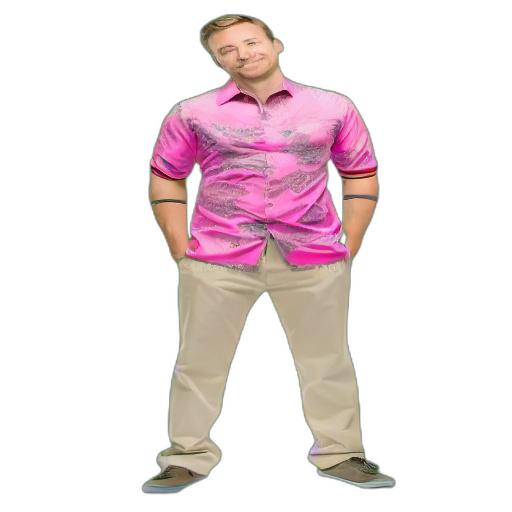

# Stable Fashion
 <!-- -->
 

*How would you look like in a gray jacket or a pink striped t-shirt?*

Decisions like this are very important when you are buying apparels from various e-commerce websits
like Amazon, Myntra etc. More often than not, we end up returning these ordered items,
because they don't look like you had imagined.
Why don't we ease the stress we put on our imagination by using state of the art generative modeling to help us.

Introducing Stable Fashion, a prompt-based on try-on app (well, only code for now), where you can write prompts such as "**A pink t shirt**" or
"**A yellow adidas shirt with black stripes**" and it would edit to put those clothing items on a full length picture of yours.

# Instructions to Run

1. Please ensure `anaconda` is installed in your system. If not, you can follow the instructions [here](https://www.anaconda.com/products/distribution).
2. Run the following command
```
conda create -n sf python=3.9
conda activate sf
cat requirements.txt | xargs -n 1 pip install
```

3. To run the pipeline, use this sample command
```
python main.py --image ../../assets/stockimage.jpeg --resolution 512  --prompt "yellow shirt"  --part upper  --num_steps 25   --output stock_yellow.jpg
```
Other available options are
```
Stable Fashion API, allows you to picture yourself in any cloth your imagination can think of!

optional arguments:
  -h, --help            show this help message and exit
  --image IMAGE         path to image
  --part {upper,lower}
  --resolution {256,512,1024,2048}
  --prompt PROMPT
  --num_steps NUM_STEPS
  --guidance_scale GUIDANCE_SCALE
  --rembg
  --output OUTPUT
```
4. The image will be saved as whatever name you provide with `--output`. The default is `output.jpg`. in the root directory of the project.
# Things to Keep in Mind

1. Please ensure you only describe the clothing item in your prompt. Any other information throws off the model for the time being.

:white_check_mark: A green hoodie

:x: A green hoodie wrapped around the waist

2. Currently, the code relies on a GPU. Please ensure you have an NVIDIA GPU with the appropiate CUDA kernel.

3. Please ensure your full length picture is taken from front, with a whitish background. It helps the model to isolate you in the picture.


# Models Used
For this app, first we segment the human out of the image. For this we use [rembg](https://github.com/danielgatis/rembg). Then we segment the upper and lower clothes using the [cloth segmentation repository](https://github.com/levindabhi/cloth-segmentation). On top of this we run the [stable diffusion inpainting pipeline](https://huggingface.co/runwayml/stable-diffusion-inpainting) from huggingface.


# Results

These are some of the results of the prompts on a stock full length image.

| Original Image | Prompt: a yellow shirt  | Prompt: A pink shirt |
|----------------|---------------------------------|--------------------------------|
|                |                                  |                                |

# Next Steps

- [x] Converting this to a single read, single write code-base.
- [x] Adding CPU support
- [ ] Wrapping this up in an API and hosting it
- [ ] Making an UI

# Acknowledgments

Thanks to huggingface, runway-ml and @levindabhi for their wonderful codebases.

# Feedback
This is a hobby project and has some pretty gaping holes. I am very happy to recieve feedback and PRs. You can reach out to me on
twitter: [@o_v_shake](https://twitter.com/o_v_shake) or open an issue in this repository.